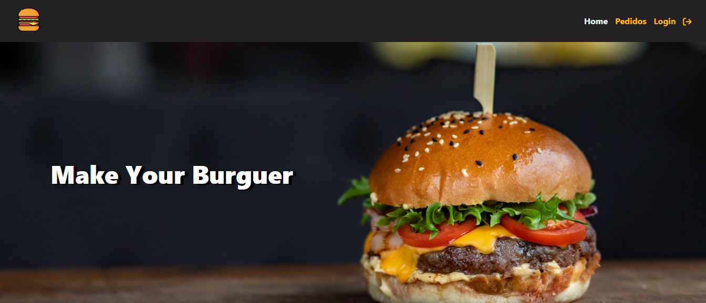

# Make Your Burguer

<p align="center">
  
</p>

O projeto foi desenvolvido com base nos materiais do <a href="https://youtu.be/wsAQQioPIJs?si=AHC8uNCCc93DPm65" target="_blank"> Matheus Battist </a> no youtube.

## 🔥 Introdução

Consiste em funcionalidades de CRUD onde é possível fazer um pedido para depois editar seu status
ou até cancelar o pedido.

Fui além e fiz uma integração com o firebase usando o firestore e a autenticação pelo provedor do google.
Podendo também criar uma conta e fazer o login com email e senha.

## Deploy

- [Deploy do site](https://make-your-burguer-chi.vercel.app/)

## 📦 Tecnologias usadas:

- HTML, CSS e JS
- Git e Github
- Vue 3
- Firebase firestore e authentication

- ## :rocket: Como executar
- 
```
  git https://github.com/William-Romeu-Bronstrup/VueBurguer.git

  cd makeBurguerProject
  npm i
  npm run dev
```

## :memo: Licença

Esse projeto está sob a licença MIT.
